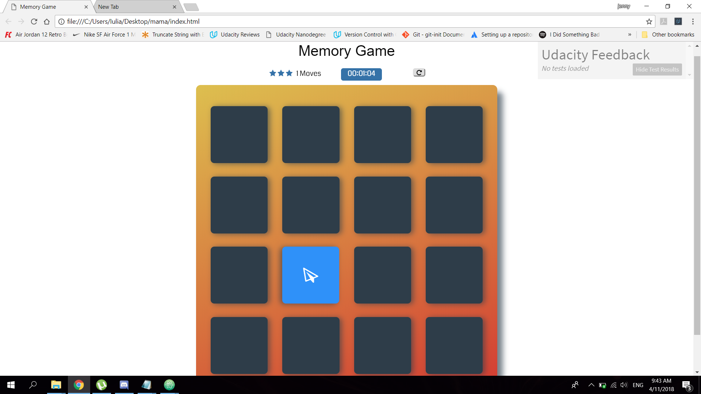

# Memory Game Project
This is a simple game built to test a users memory. There's a deck of cards with different icons.
## Getting started

## Prerequisites
-CONTRIBUTING.md

## Installing
-unzipp the file
-open index.html or this link : file:///C:/Users/Iulia/Desktop/fend-project-memory-game-master/index.html
-Once opened, you can start your game. Watch out for the refresh button, the timer and the moves.

## Instructions
* Click on a card
* Keep revealing cards and working your memory to remember each unveiled card.
* Match cards properly with less moves and in faster time

##Explaining the code
let card = document.getElementsByClassName("card");
let cards = [...card];
console.log(cards);
The code above is a representation of the javascript file, to be precise, the beginning of the algorithm.
My algorithm helped me get the cards as well as let them shuffle, get them to match, count the moves,get star rating and a timer as well.

## Built with

* Atom - application built for HTML,JavaScript,css
* Gitbash- a command line program

##Contributing

Please read CONTRIBUTING.md for details on our code of conduct.
##Authors

* Iulia HM -initial work- Udacity
